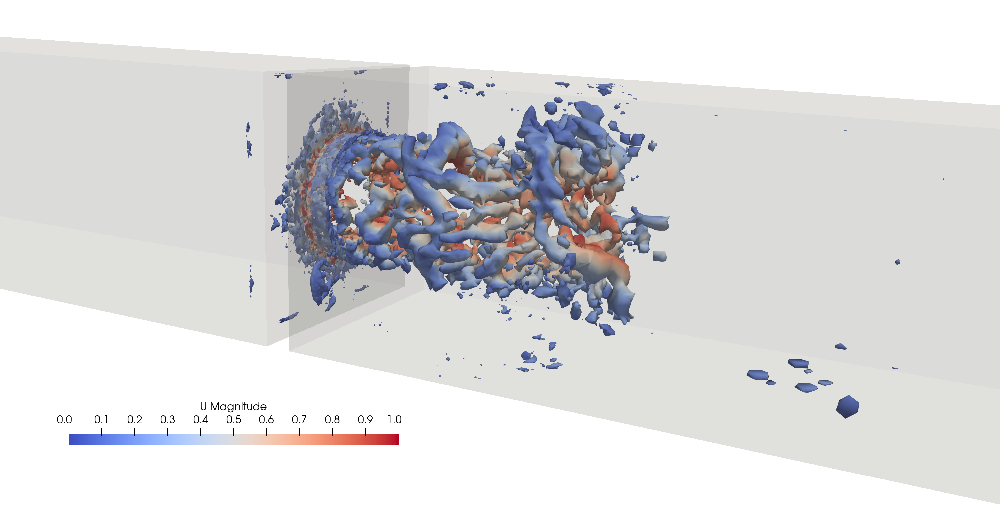
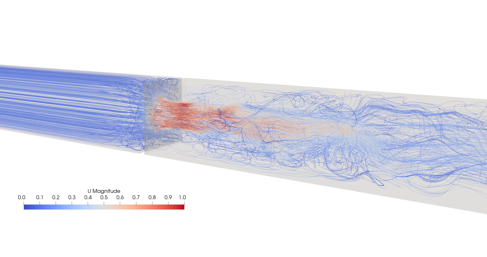

# About
This is some visuals for an example of the turbulent flow through a rectangular pipe with a hydraulic diameter of $d_h=50$ mm.
The orifice is circular with a radius of $r=25$ mm. The simulation is performed using large-eddy simulation (LES).

The flow upstream is a simple plug flow with a Reynolds number of $Re=6000$.

Keep in mind that this is an example where the mesh density is not independent and results are only used for visuals.

If the video doesn't play, [click here](https://github.com/kasperbilde/Stuff/raw/main/orifice/visuals/orifice.mp4) to download the video.

## Some turbulence plots
The Q-criterion with isocontours of $Q=4000$ is visualised in the figure below.

The streamlines of through the orifice is also visualised. Here it is obvious that the inlet velocity profile is a unreal plugflow.

All visuals are found in the [visuals directory](https://github.com/kasperbilde/Stuff/tree/main/orifice/visuals/).